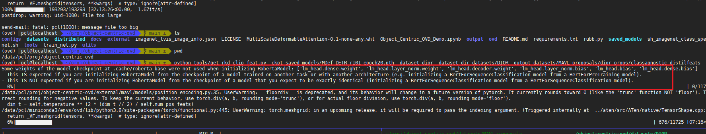
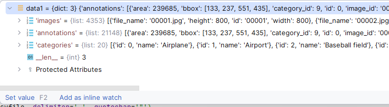

## The curation of rs datasets

basic information about rs dataset and dior dataset:

rs dataset: 117 classes where 14 classes overlapped

dior dataset: 20 classes

steps:

1. (in `create_rs_imagenet_json.py`)This version has taken the dior datasets into account.
   Dior datasets(object detection) have 20 classes. 15 classes are set as seen classes and 5 classes are set as unseen classes.
   For this rs datasets(classification), all of them should be set as unseen classes. But due to the lack of groundtruth boundingbox,
   we do not use the rs dataset for evaluation. We only use the rs dataset for training.

   And there are some classes in rs dataset overlapping with dior dataset. So we have manually set the category_id for each class in rs dataset stored in `category2id.xlsx`.

   One more thing: in dior dataset, there is one class called `train station`, while in rs dataset, there is one class called `railway station`.
   So, we change the `railway station` to `train station` in rs dataset manually.

The general process in the following code:

1. Rename folders and replace the space with `_`.
2. Read `category2id.csv` and get the mapping from category to id
3. Rename the class `railway station` to `train station`.
4. Iterate over image folder, rename every image.
5. Save them to json file.

`python create_rs_imagenet_json.py`. It will generate `image_info.json`, `id2category.json`, `category2id.json`.

2. `python tools/get_ils_labels.py -ckpt saved_models/MDef_DETR_r101_epoch20.pth -dataset rs -dataset_dir datasets/remote_sensing -output datasets/MAVL_proposals/rs_props/class_specific/`
   to generate pseudo labels under `datasets/MAVL_proposals/rs_props/class_specific/`.
3. Here are two ways to proceed. One is to use sperate pseudo-label files for each image. The other is to aggregate all the pseudo-labels into one json file.
   i. `python tools/create_lvis_ils_json.py -dataset_dir datasets/remote_sensing -prop_path datasets/MAVL_proposals/rs_props/class_specific -target_path datasets/remote_sensing/annotations/rs_pis_aggregated.json`
   to generate `rs_pis_aggregated.json` which simply aggregate the pseudo labels and the original labels to one json file.
   ii. `tools/create_simlink_lvis.py` to generate the simlink for each image's pseudo label file and aggregate them into another folder `datasets/MAVL_proposals/rs_props/class_specific2`.
4. Edit the dataset config file under the path `ovd/datasets` and edit the training config file under the path `configs/rs`.
4. Go to train the model!
   `python train_net.py --num-gpus 1 --config-file configs/rs/RS_OVD_Base_PIS_1.yaml`

## the alignment between dior and rs

Besides the first point in the above steps, there's another issue.
There are some contradictions between `ovd/datasets/DIOR_zero_shot.py` and (`instances_DIOR_train_seen_2_oriorder_cat_info.json`, `instances_DIOR_train_seen_2_oriorder.json`) .
I manually add the extra 117 classes to the rest of the categories for (`instances_DIOR_train_seen_2_oriorder_cat_info.json`, `instances_DIOR_train_seen_2_oriorder.json`)
in `tools/supplement_20_categories_with_117_categories.py`.

## the generation of  `classagnostic_distilfeats`

1. When we want to train with rkd config, we need to generate the `classagnostic_distilfeats` for each dataset.
2. And in the `train_net.py`'s datasets processing, they are treating the whole distilfeats in one folder, so it's necessary to aggregate all the files into one folder by simlink.

`python tools/get_rkd_clip_feat.py -ckpt saved_models/MDef_DETR_r101_epoch20.pth -dataset rs -dataset_dir datasets/remote_sensing -output datasets/MAVL_proposals/rs_props/classagnostic_distilfeats`
`python tools/get_rkd_clip_feat.py -ckpt saved_models/MDef_DETR_r101_epoch20.pth -dataset dior -dataset_dir datasets/DIOR -output datasets/MAVL_proposals/dior_props/classagnostic_distilfeats`

## the curation of 20_merge dataset



## It's the chatgpt prompt generate for `create_rs_imagenet.py` in `tools` folder.

It's the dataset sturcture. The subfolder's name is the category name.

```

- apple tree
    - 1.jpg
    - 2.jpg
    - ...
- pineapple
    - 1.jpg
    - 2.jpg
    - ...
- paper
    - 1.jpg
    - 2.jpg
    - ...
      ...

```

I want to help me write a piece of code to process the data and generate two json file.
One json file saves the mapping from `category_id` and `category_name`. Both direction should be included.
Another json file saves the image info. The format is shown as follows.
So, generally, the process should be like this.

1. preprocess the image folder name: delete the `space` in the name.
2. Generate `category_id` for each`category_name` and create the corresponding mapping which should include both direction.
3. Iterate over every image in every subfolder. Generate id to `id` field, record image path to `file_name` field, record `category_id` to `pos_category_ids` field, check out the image width and height and save them to `width` and `height` field.

```

{"id": 866847, "file_name": "n04225987/n04225987_2911.JPEG", "pos_category_ids": [962], "width": 332, "height": 500}, {"id": 866848, "file_name": "n04225987/n04225987_2915.JPEG", "pos_category_ids": [962], "width": 400, "height": 500}, {"id": 866849, "file_name": "n04225987/n04225987_2916.JPEG", "pos_category_ids": [962], "width": 500, "height": 375}, {"id": 866850, "file_name": "
n04225987/n04225987_2918.JPEG", "pos_category_ids": [962], "width": 393, "height": 500},...
}

```

I have written some pseudocode for you. Based on the pseudo code and the above instruction, help me write the code.

```

dataset_folder ='datasets/remote_sence_imagenet'

for f in dataset_folder:
# rename the folder name: delete the space
pass

category2id = {}
id2category = {}
for f in dataset_folder:
# generate the category_id for each folder and generate the mapping
pass

# save them to json file

image_info = {}
for f in dataset_folder:
for img in f:
# generate the id, file_name, category_id, width, height. And save them to image_info
pass

# save them to json file

```

## the simple explanation about the miscellaneous annotation files

you can manually check these files by using the checking python scripts under `check_tools/`.

`instances_DIOR_train_seen_2_oriorder_2.json`
`instances_DIOR_train_seen_2_oriorder_cat_info_2.json`
These two files are for the 117-classes classification datasets.

`instances_DIOR_train_seen_2_oriorder_cat_info.json`
`instances_DIOR_train_seen_2_oriorder.json`
These two files are for the 20-classes classification datasets. It contains the 20 classes' information and the 117 classes' information.
About `instances_DIOR_train_seen_2_oriorder.json`:


`datasets/zeroshot_weights/DIOR_clip_a+photo+cname.npy`
`datasets/zeroshot_weights/DIOR_rs_clip_a+photo+cname.npy`
These two files are the zero-shot weights for the 20-classes and 117-classes classification datasets respectively.
They are generated by `tools/dump_clip_features.py`.

## explanation annotations about 20_merge dataset

20_merge dataset has included more data than 20_only dataset.
`tools/convert_20_merge_to_standard_class_specific_files.py` is used to convert the 20_merge dataset to the standard class-specific files.
Files are located at `datasets/DIOR_20_Merge_labled/pkl`.
`tools/generate_image_info_for_20_merge.py` is used to generate the `image_info.json` for 20_merge dataset.
The file's path is `datasets/DIOR_20_Merge_labled/20_merge_image_info.json`.

## explanation annotations about dior-automatic dataset

Because of the domain shift between the dior dataset and the remote sensing dataset, we need to generate classification dataset from the dior dataset.
Here comes the dior-automatic dataset.
This dataset's path is `datasets/DIOR_automatic_label/json`.
So still, we need to convert the dior-automatic dataset to the standard class-specific files by using `tools/convert_dior_automatic_to_standard_class_specific_files.py`.
Files are located at `datasets/DIOR_automatic_label/pkl`.
`tools/generate_image_info_for_dior_automatic.py` is used to generate the `image_info.json` for dior-automatic dataset.
The file's path is `datasets/DIOR_automatic_label/dior_automatic_image_info.json`.